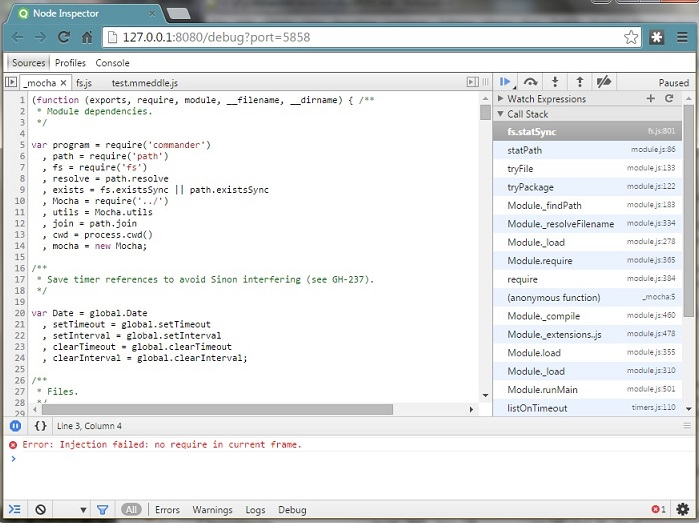

# mMeddle Developer's Guide
[![Build Status][travis-image]][travis-url] 
[![Coveralls Status][coveralls-image]][coveralls-url]
[![NPM version][npm-image]][npm-url]
[![Dependency Status][depstat-image]][depstat-url]

[npm-url]: https://www.npmjs.com/package/mmeddle
[npm-image]: https://badge.fury.io/js/mmeddle.svg

[nodeico-url]: https://nodei.co/npm/mmeddle/
[nodeico-image]: https://nodei.co/npm/mmeddle.png?compact=true

[travis-url]: https://travis-ci.org/jfogarty/mmeddle
[travis-image]: https://img.shields.io/travis/jfogarty/mmeddle.svg?branch=master

[coveralls-url]: https://coveralls.io/r/jfogarty/mmeddle
[coveralls-image]: https://img.shields.io/coveralls/jfogarty/mmeddle.svg

[depstat-url]: https://david-dm.org/jfogarty/mmeddle
[depstat-image]: https://david-dm.org/jfogarty/mmeddle.svg

[https://github.com/jfogarty/mmeddle](https://github.com/jfogarty/mmeddle)

`mmeddle.js` is a symbolic math workspace for browsers and Node.js. It features pluggable types, operators, units, and functions.

# mMeddle IS NOT YET OPEN FOR DEVELOPMENT
### move along please, these aren't the droids you're looking for...

[![NPM NODE ICON][nodeico-image]][nodeico-url]

This library is the headless workhorse for maintaining *mMeddle* documents, 
and performing symbolic math operations. It runs in backend servers as
an **Express** application using a **MongoDB** database for primary storage. 
The same engine runs in browsers as a minified script as part of the *mMeddler*
SPA (single page application).

This document provides a developer's overview for building and testing mmeddle bits.
For code structure documents, you can read the README.md files in each source directory
and build the `docs/src/index.html` for the generated API as described here.

## That Vision Thing

The grand plan (or pipe dream) is for *mMeddle* to become a community service
which loads the *mMeddler* SPA user interface to client pads and computers.
*mMeddler* users will write their own math-based documents using standard
mathematical notations, manipulate equations using drag and drop based symbolic
algebra, and produce numerical results in the form of values, graphs and tables.

The backend service will maintain a cloud of private and public symbolic math
documents organized by scientific, engineering, mathematical, and pedegogical topics.
Math inclined programmers will extend the nature of the maths that we can handle,
while subject matter experts will publish and edit live documents containing equations, expanations, problems, and solutions. Student, teachers, geeks and the strangely
curious will have access to a level of math that has mostly been out of reach
through layers of technical barriers. A golden age will flourish and all world problems
will be solved as a direct result of your hard work on this bucket of code. 

## Structure

*mMeddle* is structured as a single main module `mmeddle` which contains 
bindings between the other modules. Modules within sub-directories usually contain no *requires* statements unless they are to anode_module (preferably
one which is in some way unique to a single module) or to a sub-directory
from the one containing the module. `require("..\[a modulename]")` 
is **not** permitted in this code.

Isolating the bindings between modules to a single outer level module 
greatly eases restructuring and module substitution for the various 
environments in which mmeddle must run.

## Building

Gulp and a `gulpfile.js` provide the build and test environment:

    gulp
    
This runs the gulpfile.js `default` task which performs verification tests,
then builds and packages the various forms of the library.

The build steps are currently:

Task | Description
---- | -----------
**test** | do the node.js Mocha BDD BVTs tests using a mock SAL (service abstraction layer)
**lint** | jshint the source using `.jshintrc` rules
**clean** | delete the `./dist` directory contents
**bundle** | **WebPack** the client for use in a browser
**minify** | make a .min version for reasonable load times
**testb** | run the browser BVTs using a **PhantomJS** headless browser

## Testing

Testing is primariy done with a set of **Mocha** tests using the **BDD** (behavior
driven development) style. Developers are strongly encouraged to use this style
for their own tests. All integrations require passing tests. Note the boilerplate
code in the top of `test.*js` files to allow the same tests to run in your browser,
the **PhantomJS** headless browser, and **node.js**.

To run the **BVT**s (base verification tests) use:

    gulp test
    
During development continuous tests on every source change is enabled with:

    gulp watch
    
Note that `gulp watchb` does continuous PhantomJS browser based testing but is
more annoying since the bundled mmeddle.js must be rebuilt on every source change.
    

Every test **.js** source file starts with a `test.` prefix.  

##  Browser Testing
    
Browser BVT tests are started from `test\testMocha.html`.
    
    
### Code Coverage

If you are using test driven development rather than writing all your tests
after your code has lumbered into life, its easy to keep your coverage numbers
up. Check the current coverage using:

    gulp coverage
    
This runs the **istanbul** code coverage tool against the Mocha test suite.  You can
examine the annotated source by browsing to `./coverage/lcov-report/index.html` or run

    gulp showcoverage
    
We want our code coverage numbers over **90%**, so don't be shy about addng test cases.
    
### Testing With Persistent Data

You'll probably quickly get tired of testing without any persistent data. The next step
is to enable the local filesystem Storage SAL plugin: `storageFs`. When that gets old, install
a [MongoDB server](https://www.mongodb.org/downloads) and enable the `storageMongoDB` Storage
SAL plugin.

## Local Execution

The mMeddle server (server.js) is started in the traditional way with:

    npm start

By default the is an `Express` web server which exposes the entire development
tree as static content on **localhost:8080**. The `index.html` page has links
to various things of interest.

## Cloud Build Automation

The [github/mmeddle](https://github.com/jfogarty/mmeddle) repository is linked
to the [Travis-CI/mmeddle](https://travis-ci.org/jfogarty/mmeddle) service. Every commit
pushed to the **master** branch triggers an npm install and cloud build of the 
default **npm test** (gulp test task). When this succeeds **gulp coverage** is run,
and the new code coverage statistics are pushed to
[coveralls/mmeddle](https://coveralls.io/r/jfogarty/mmeddle). The build and code
coverage push update the little badges in the upper left corner of the README.md in
the project root. These should of course stay green.

mMeddle is currently hosted at RedHat's OpenShift node.js service at
[openShift/mmeddle](http://mmeddle-jfogarty.rhcloud.com/). 
This hosts a MongoDB database for the test service. This database is firewalled
and can't be accessed from outside, although you can ssh to the server and
run the mongo cli from the shell.

We are currently not automatically pushing *mMeddle* to the test service, so I
do that when I'm happy with the current state of the build. At some point we can
turn on automatic pushing directly from [Travis-CI](https://travis-ci.org) since
it has built-in OpenShift support.
 
For most testing we use a globally accessible MongoDB
test database at [MongoLab](https://mongolab.com/) 
named [`mmSpace`](https://mongolab.com/databases/mmspace).  
This is accessed using a connection URL or mongo CLI that looks a lot like:

    mongodb://<dbuser>:(<dbpassword>)@ds061621.mongolab.com:61621/mmspace
    mongo ds061621.mongolab.com:61621/mmspace -u <dbuser> -p <dbpassword>

Contact me at [johnhenryfogarty@gmail.com](mailto:johnhenryfogarty@gmail.com)
once you have a commit under your belt if you need access to the test database.
The database is small (limited to 500MB) and I can't  guarantee any
kind of stabiliy to its structure or contents for some time to come.
    
## Documentation

Documentation is mostly generated from the source using jsdoc tags throughout
the code. The task to build the docs is:

    gulp docs

Each `./src` directory contains its own **README.md** markdown document which
provides a **short** overview on the structure and use of the source in broad 
terms. This should not restate the jsdoc and should try not be more than a
page long. 

The generated docs can be accessed via [../api/index.html](../api/index.html).

## Debugging

Sometimes you've got no choice.

### Debugging Unit Tests

I debug unit tests for node using node-inspector on Chrome on a Windows system, so your experience may differ.  Start `node-inspector` in its own shell and leave it running, then:

    node-debug --debug-brk node_modules\mocha\bin\_mocha -u bdd -r should

The `_mocha` selects the *real* .js file for the mocha engine, instead of the stub that launches a separate test process. Note that there are a lot of checked exceptions thrown and there is a timer used by mocha that may annoy you. Often it is easier to just debug an scratch function without having the Mocha infrastructure getting in the way.

**Note:** My console log always starts with the message:
> Error: Injection failed: no require in current frame

I ignore this but, nothing bad seems to happen. This may be related to 
[node-inspector broken](https://github.com/node-inspector/node-inspector) : 
(*Node Inspector is currently broken on Node >= v0.11.14*)
since I am currently debugging under node 0.12.0. It is flakey, but usually
gets the job done. Good luck.

### Debugging Browser Unit Tests

Debugging for the browser consists of opening `test\testMocha.html` under your favorite browser and using its script debugging tools. I prefer **Mozilla Firefox** with the **Firebug console** add-in. Don't forget to run the **gulp bundle** task first or you will be debugging an old version (I've never done that).

The Mocha page is nice in that you can select and drill down into test suites anmd rerun the tests individually. Clicking a test's **it()** text shows the source of the test.

## Windows Development (sigh)

I write code on Windows and need to keep the development environment Windows friendly (or
at least no more unfriendly than necessary). 

In **git config** if you use Windows, you should set

    git config core.autocrlf input

The files in the repository should not contain CRLF endings, and you should use an
editor on Windows that doesn't put them on by default (I use Notepad++).

I use **gulp** and put some effort into making sure that any scripts are equivalent
on Windows and *nix versions. The Travis-CI integration service helps with this.

## Possibly Helpful Notes

### Relax Firefox localhost file access

In Firefox go to the fake URL **about:config**.  Promise to be careful.
Change **security.fileuri.strict_origin_policy** to false.

### Relax Chrome localhost file access

From the command line (in the chrome installation directory):

    chrome --allow-file-access-from-files
    
### Windows Node 0.12.0 and socket.io incompatibility

This annoying problem currently (Apr 2015) does not allow the latest
socket.io to install without a NanSymbol deprecated error during the
windows compilation. Let this finish then:

    cd node_modules\socket.io\node_modules\engine.io\node_modules
    npm install ws@latest
    
This is ugly but works fine and lets Windows development continue.
